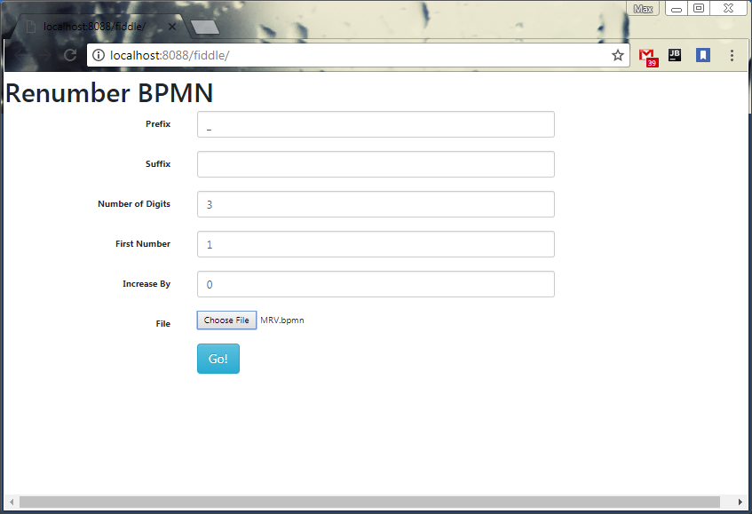

v.02 - Added negative number *increments*

# BPMN Fiddle
BPMN Fiddle is a self-contained spring boot application that helps you to renumber and tidy BPMN maps for AFMS.

   1. Run the app (mvnw.cmd spring-boot:run)
   2. set the first number to increase
   3. set the amount to increase by
   4. select file
   5. download renumbered BPMN map.
   6. Test the new renumbered map
   7. Carry on with your life.
    

#### Example MAP:

    1, 2, 4, 5, 6, 9, 10

    
**Start: 1, Increase by: 0** 
 
    1, 2, 3, 4, 5, 6, 7
    
**Start: 1, Increase by: 1**  
        
    2, 3, 4, 5, 6, 7, 8
    
**Start: 4, Increase by: 2**  
        
    2, 3, 6, 7, 8, 9, 10
    
**Start: 3, Increase by: 2**  
        
    1, 2, 4, 5, 6, 7, 8
    
